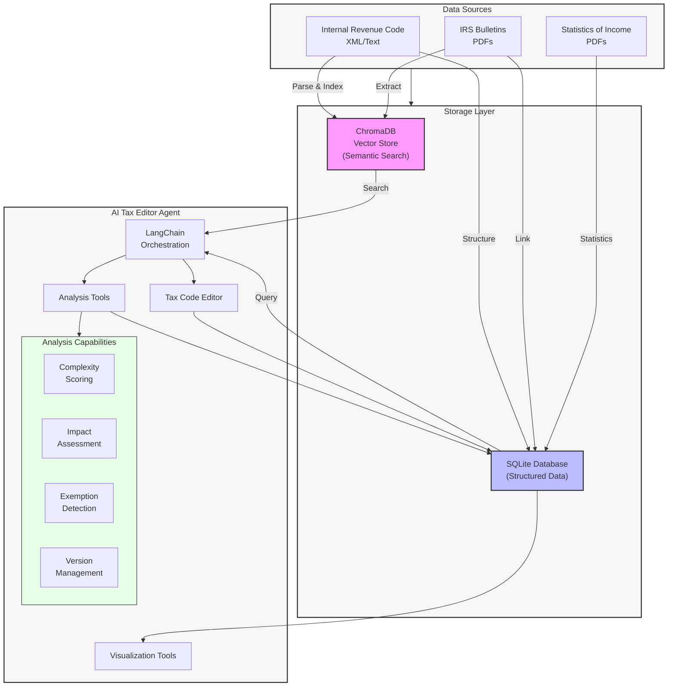
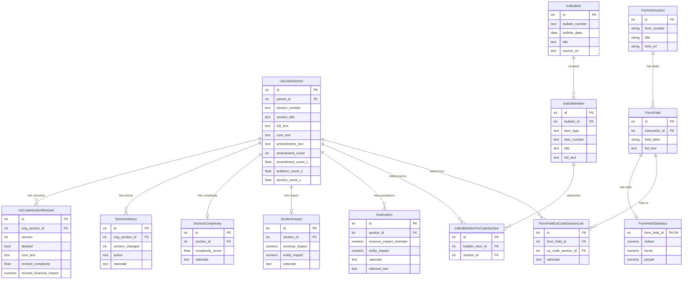

# AI Tax Agent: Simplifying the U.S. Tax Code

## Project Goal

This project aims to build an iterative AI agent that analyzes, simplifies, and streamlines the U.S. tax code. It uses LangChain, ChromaDB (vector store), and a relational database (SQLite via SQLAlchemy/Alembic) to achieve this.

The agent will:

1.  Ingest and analyze the Internal Revenue Code (IRC), IRS bulletins/guidance, and IRS Statistics of Income.
2.  Assess tax code sections based on complexity, financial impact, and avoidance opportunities.
3.  Iteratively simplify the code by removing/combining sections and rewriting them clearly.
4.  Track each simplification step, aiming for a final target of ~10 pages each for personal and business taxation.

## System Architecture



The system architecture consists of three main layers:

1. **Data Sources**
   - Internal Revenue Code (IRC) in XML/text format
   - IRS Bulletins (IRBs) in PDF format
   - Statistics of Income (SOI) data in PDF format

2. **Storage Layer**
   - ChromaDB: Vector store for semantic search and retrieval
   - SQLite: Relational database for structured data and relationships

3. **AI Tax Editor Agent**
   - LangChain: Orchestrates the overall workflow and agent behavior
   - Analysis Tools: 
     * Complexity scoring of tax code sections
     * Impact assessment using SOI data
     * Exemption detection and analysis
     * Version management of simplified sections
   - Tax Code Editor: Handles the iterative simplification process
   - Visualization Tools: Generate 4K resolution analysis plots

## Analysis & Visualization Tools

The project includes several sophisticated analysis and visualization tools:

### Complexity Analysis
* `scripts/analyze_complexity_distribution.py`: Generates a 4K resolution plot showing the distribution of complexity scores across all tax code sections. Includes histogram, kernel density estimation, and key statistics (mean, median, range).
* `scripts/plot_complexity_distribution.py`: Creates a 3D scatter plot visualizing the relationship between section complexity, financial impact, and entity impact. Highlights three key regions:
  - High Impact/High Complexity
  - Low Impact/Low Complexity
  - Low to Moderate Impact/High Complexity

### Impact Analysis
* `scripts/analyze_section_mentions.py`: Analyzes the frequency of section mentions in IRS bulletins and their correlation with amendment counts. Generates two plots:
  - Top sections by bulletin mentions
  - Correlation between mentions and amendments

### Code Growth Analysis
* `scripts/analyze_code_size.py`: Tracks the growth of the tax code over time by analyzing:
  - Base tax code page count
  - Cumulative bulletin pages
  - Projects future growth based on historical trends

### Version Analysis
* `scripts/run_tax_editor_v2.py`: Manages the iterative simplification process:
  - Tracks versions of simplified sections
  - Handles deleted sections
  - Processes exemptions and their impact
  - Updates complexity scores and status

## Setup

This project uses [Poetry](https://python-poetry.org/) for dependency management and packaging.

1.  **Install Poetry:**
    *   If using Homebrew (macOS): `brew install poetry`
    *   Otherwise, follow the [official installation instructions](https://python-poetry.org/docs/#installation).

2.  **Clone the repository (if you haven't already):**
    ```bash
    git clone <repository-url>
    cd ai-tax-agent
    ```

3.  **Install Git LFS:**
    This project uses [Git Large File Storage (LFS)](https://git-lfs.github.com/) to manage large data files (e.g., tax documents in the `data/` directory). You need to install the Git LFS client to download these files correctly.
    *   If using Homebrew (macOS): `brew install git-lfs`
    *   Otherwise, follow the [official installation instructions](https://git-lfs.github.com/).
    After installing, ensure LFS is initialized for your user account (usually only needed once per machine):
    ```bash
    git lfs install 
    ```
    If you cloned the repository *before* installing Git LFS, navigate into the repository directory and run `git lfs pull` to download the large files.

4.  **Install dependencies:**
    ```bash
    poetry install
    ```

5.  **Set up the database:**
    The project uses SQLite and Alembic for database schema management. Run the initial migration:
    ```bash
    # Ensure the database file (tax_data.db) exists and is up-to-date
    make db-migrate
    ```
    *Note: Subsequent model changes will require generating new migrations (`poetry run alembic revision --autogenerate -m "..."`) before running `make db-migrate` again.*

## Usage

### Makefile Targets

This project uses a `Makefile` to streamline common tasks. Here's a breakdown of the available targets and their recommended execution order:

**Recommended Execution Order (for initial setup & data processing):**

1.  `make download-bulletins`
2.  `make db-migrate`
3.  `make parse-tax-code` (Requires `data/usc26.xml`)
4.  `make parse-bulletins` (Requires downloaded PDFs in `data/irb/`)
5.  `make link-bulletins` (Links parsed bulletins to parsed code sections in the DB)
6.  (Optional Analysis) `make analyze-size`, `make analyze-mentions`
7.  (Testing) `make test`, `make test-unit`, `make test-integration`

**Target Descriptions:**

*   `download-bulletins`
    *   Runs `scripts/download_irb_bulletins.py` to download Internal Revenue Bulletins (IRBs) as PDFs into the `data/irb/` directory.
*   `db-migrate`
    *   Applies database migrations using Alembic. Creates or updates the database schema in `data/tax_data.db` based on models defined in `ai_tax_agent/db/models.py`.
*   `parse-tax-code`
    *   Runs `scripts/parse_tax_code.py` to parse the main IRC XML file (`data/usc26.xml`) and populate the `us_code_section` table in the database.
*   `parse-bulletins`
    *   Runs `scripts/parse_bulletins.py` to parse the downloaded bulletin PDFs, extracting metadata and potentially text, populating the `irs_bulletin` and `irs_bulletin_item` tables.
*   `link-bulletins`
    *   Runs `scripts/link_bulletins_to_sections.py` to identify references to IRC sections within the parsed bulletin text and create links in the `irs_bulletin_item_to_code_section` table.
*   `analyze-size`
    *   Runs `scripts/analyze_code_size.py` to count pages in the main tax code PDF and downloaded bulletins, generating a plot of size over time (`plots/tax_code_growth.png`).
*   `analyze-mentions`
    *   Runs `scripts/analyze_section_mentions.py` using data from the database to analyze the frequency of section mentions in bulletins and their correlation with amendment counts. Generates plots (`plots/top_bulletin_mentions_from_db.png`, `plots/mentions_amendments_correlation_from_db.png`).

*   **PDF Parsing (using Multimodal LLM):**
    *   The primary approach for extracting structured data from PDF documents (like the IRS Statistics of Income PDFs) now relies on multimodal Large Language Models (LLMs) like Google Gemini Pro Vision / Flash Vision.
    *   `parse-pdf-json PDF_PATH=<path_to.pdf> START_PAGE=<page_num>`:
        *   Runs `scripts/parse_pdf_to_json.py`.
        *   Processes the specified PDF starting from `START_PAGE`.
        *   For each page, it uses two LLM calls:
            1.  `extract_structure_multimodal`: Identifies Form Title, Schedule Title, and extracts Line Item numbers and labels based on visual layout.
            2.  `associate_amounts_multimodal`: Associates numeric amounts (identified heuristically by color) with the line items found by the first LLM call.
        *   Validates that essential fields (page number, title) were extracted for each page.
        *   Outputs the aggregated structured data for all processed pages into a JSON file named `<input_pdf_name>.json` in the same directory as the input PDF.
        *   Example: `make parse-pdf-json PDF_PATH=data/tax_statistics/individuals.pdf START_PAGE=3`
    *   (Legacy/Experimental) `parse-pdf-structure PDF_PATH=<path> PAGE_NUM=<num>`: Parses a single page using older heuristic methods (no longer the primary approach).
    *   (Legacy/Experimental) `parse-pdf-mcid PDF_PATH=<path> PAGE_NUM=<num>`: Analyzes Marked Content Identifiers (MCIDs) on a single page.

*   **Testing:**
    *   `test`
        *   Runs all available tests (unit and integration).
    *   `test-unit`
        *   Runs only the unit tests located in `tests/unit`.
    *   `test-integration`
        *   Runs only the integration tests located in `tests/integration`.
    *   To run specific integration tests:
        *   `poetry run pytest tests/integration/test_pdf_parsing.py -s -v -k test_pdf_page_structure[26-page_26_expected.json]` (Runs the parameterized PDF parser test for page 26)
        *   `poetry run pytest tests/integration/test_pdf_title_extraction.py -s -v` (Runs the test specifically for title extraction heuristics - potentially deprecated)

*(Note: Other targets like `parse-tax-code-custom`, `analyze-amendments`, `index-*` etc., exist for specific data processing or indexing tasks. Refer to the `Makefile` for details.)*

**Additional Analysis Targets:**

* `make plot-complexity`
  - Generates high-resolution (4K) visualizations of tax code complexity distribution
  - Output: `plots/section_complexity_distribution.png`

* `make plot-impact`
  - Creates 3D scatter plots of section impact vs. complexity
  - Output: `plots/section_impact_complexity_3d.png`

### Key Metrics

The project tracks several key metrics for each tax code section:

1. **Complexity Score** (0-10 scale):
   - Current distribution: Mean=5.30, Median=4.50
   - Range: 0.20 (simplest) to 9.80 (most complex)

2. **Impact Metrics**:
   - Financial Impact: Revenue generated/lost (in USD)
   - Entity Impact: Number of taxpayers/forms affected
   - Exemption Impact: Revenue and entities affected by specific exemptions

3. **Amendment Tracking**:
   - Historical amendment count
   - Bulletin references
   - Version history of simplification attempts

### Database Schema (`data/tax_data.db`)

The project uses an SQLite database managed by SQLAlchemy and Alembic. Below is the complete entity-relationship diagram:



The schema consists of several key components:

1. **Core Tax Code Management**
   - `UsCodeSection`: Base table storing tax code sections
   - `UsCodeSectionRevised`: Tracks versions of simplified sections
   - `SectionHistory`: Records changes and actions taken on sections

2. **Analysis Components**
   - `SectionComplexity`: Complexity scores and rationale
   - `SectionImpact`: Revenue and entity impact assessments
   - `Exemption`: Specific exemptions within sections

3. **IRS Bulletin Integration**
   - `IrsBulletin`: Bulletin metadata
   - `IrsBulletinItem`: Individual items within bulletins
   - `IrsBulletinItemToCodeSection`: Links bulletins to relevant sections

4. **Form Analysis**
   - `FormInstruction`: IRS form metadata
   - `FormField`: Individual fields within forms
   - `FormFieldStatistics`: Impact statistics for form fields
   - `FormFieldUsCodeSectionLink`: Links forms to relevant code sections

## Visualization Outputs

All visualization scripts output high-resolution (3840x2160) plots for detailed analysis:

1. `plots/section_complexity_distribution.png`
   - Distribution of complexity scores
   - Includes mean/median indicators and density estimation

2. `plots/section_impact_complexity_3d.png`
   - 3D visualization of impact vs. complexity
   - Color-coded regions for different impact/complexity combinations

3. `plots/tax_code_growth.png`
   - Historical and projected growth of tax code size
   - Includes both base code and cumulative bulletin pages

4. `plots/top_bulletin_mentions_from_db.png`
   - Most frequently referenced sections in IRS bulletins

5. `plots/mentions_amendments_correlation_from_db.png`
   - Correlation between bulletin mentions and amendment frequency

## Future Development

Planned enhancements include:

1. Integration of machine learning models for:
   - Automated complexity scoring
   - Impact prediction
   - Optimization of simplification strategies

2. Enhanced visualization features:
   - Interactive dashboards
   - Real-time tracking of simplification progress
   - Network analysis of section relationships

3. Automated testing and validation:
   - Consistency checks for simplified sections
   - Impact assessment validation
   - Revenue neutral verification

*(Note: Other targets like `parse-tax-code-custom`, `analyze-amendments`, `index-*` etc., exist for specific data processing or indexing tasks. Refer to the `Makefile` for details.)*